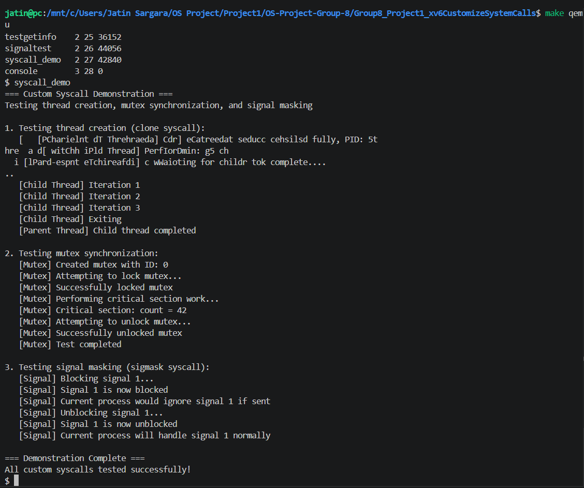

# Project 1 — Counting Semaphores & Custom Syscalls

## System Calls Implemented

| # | Syscall | Category | Syscall Number |
|---|---------|----------|----------------|
| 1 | `semget()` | IPC | 24 |
| 2 | `semwait()` | IPC | 25 |
| 3 | `sempost()` | IPC | 26 |
| 4 | `semclose()` | IPC | 27 |
| 5 | `getprocinfo()` | Process Info | 28 |
| 6 | `signal_init()` | Signals | 29 |
| 7 | `signal_send()` | Signals | 30 |
| 8 | `signal_handle()` | Signals | 31 |
| 9 | `clone()` | Threads | 32 |
| 10 | `mutex_create()` | Synchronization | 33 |
| 11 | `mutex_lock()` | Synchronization | 34 |
| 12 | `mutex_unlock()` | Synchronization | 35 |
| 13 | `sigmask()` | Signals | 36 |
| 14 | `getproccount()` | Process Info | 37 |
| 15 | `sendmsg()` | IPC | 38 |
| 16 | `createlock()` | Synchronization | 39 |
| 17 | `threadcreate()` | Threads | 40 |
| 18 | `sendsignal()` | Signals | 41 |
| 19 | `shmget()` | Shared Memory | 42 |
| 20 | `shmat()` | Shared Memory | 43 |
| 21 | `shmdt()` | Shared Memory | 44 |


## Files in This Folder

| File | Purpose |
|------|---------|
| `kernel/sem.c` | Core semaphore implementation (blocking/waking logic) |
| `kernel/sem.h` | Shared semaphore data structures and spinlocks |
| `user/semtest.c` | User-space demo program — tests synchronization |
| `user/testgetinfo.c` | User-space demo program — tests getting system info like PID |
| `user/syscall_demo.c` | User-space demo program — tests `clone`, mutex, and `sigmask` syscalls |
| `user/project1.c` | Master demonstration program for the 5 custom system calls |
| `sysproc_additions.c` | New getprocinfo syscall kernel implementation along with original ones |
| `syscall_additions.h` | Syscall number `#define` macros |
| `syscall_table_additions.c` | Extern declarations + dispatch table entries |
| `usys_additions.pl` | User-space stub generator entries |
| `kernel/signal.h` | Signal definitions and constants |
| `user/signaltest.c` | User-space demo program — tests signal handling |
| `user_additions.h` | User-space function prototypes and `struct procinfo` |
| `myshell.c` | Custom UNIX-like shell implementation (Project 2) |
| `custom_wc.c` | Custom Word Count utility (Project 2) |
| `kernel/shmem.c` | Shared memory management (kalloc-backed regions) |
| `kernel/shmem.h` | Shared memory data structures and internal types |
| `user/shmtest.c` | User-space test program for shared memory IPC |

## Semaphore API Reference

### 1. `int semget(int key, int initval)`
Initializes or retrieves a counting semaphore associated with a key. Returns the semaphore ID.

### 2. `int semwait(int id)`
The **P** (proberen) operation. Decrements the semaphore value. If the value becomes negative, the process blocks until signaled.

### 3. `int sempost(int id)`
The **V** (verhogen) operation. Increments the semaphore value and wakes up one blocked process.

### 4. `int semclose(int id)`
Destroys the semaphore and wakes up all waiting processes with an error code.

## Shared Memory API Reference

### 1. `int shmget(int key, int size)`
Creates or retrieves a shared memory ID associated with a key. Currently supports a `size` up to 1 page (4096 bytes).

### 2. `void* shmat(int id)`
Maps the shared memory region into the process's page table. Returns the starting user virtual address on success, or `(void*)-1` on error.

### 3. `int shmdt(void *addr)`
Detaches (unmaps) the shared memory region from the process's address space. The physical page is freed only when the last process detaches.

## Signal API Reference

### 1. `int signal_init(void)`
Initializes the signal table for the current process. Sets all handlers to `SIG_DFL` (default) and clears the pending-signal bitmask.

### 2. `int signal_send(int pid, int signum)`
Sends a signal to a target process identified by PID. Sets the corresponding bit in that process's pending signals bitmask.

### 3. `int signal_handle(int signum, sighandler_t handler)`
Registers a user-space handler function for a given signal number. Special handlers include `SIG_IGN` (ignore) and `SIG_DFL` (default action, usually kills process).

## About getprocinfo system call

### 1. `int getprocinfo(struct procinfo *info)`
Copies information about the current process into the user-provided `struct procinfo` buffer.
The returned data includes:

- `pid`: current process ID
- `ppid`: parent process ID
- `state`: current process state
- `name`: process name

Returns `0` on success and `-1` on failure.

## Custom Syscall Demo (New Additions)

### 1. `int getproccount(void)`
Returns the total number of active processes in the xv6 system.

### 2. `int sendmsg(void)`
A kernel-level implementation for inter-process messaging.

### 3. `int createlock(void)`
Initializes a synchronization lock within the kernel space.

### 4. `int threadcreate(void)`
Facilitates the creation of lightweight threads sharing the parent's address space.

### 5. `int sendsignal(void)`
A secondary signal delivery mechanism for cross-process communication.

## Project 2 — Custom Shell & `custom_wc`

### 1. `myshell`
A C-based shell running on the host OS that implements the `fork()` and `execvp()` model to run custom utilities.

### 2. `custom_wc`
A custom implementation of the Word Count utility that manually calculates lines, words, and characters by parsing file streams.

## Custom Syscall Demo

The `user/syscall_demo.c` program exercises the newly implemented custom syscalls:

- `clone()` for lightweight thread creation
- `mutex_create()`, `mutex_lock()`, `mutex_unlock()` for mutual exclusion
- `sigmask()` for signal masking/unmasking

### Expected `syscall_demo` Output

```text
=== Custom Syscall Demonstration ===
Testing thread creation, mutex synchronization, and signal masking

1. Testing thread creation (clone syscall):
   [Child Thread] Created successfully, PID: <pid>
   [Child Thread] Performing child-specific work...
   [Child Thread] Iteration 1
   [Child Thread] Iteration 2
   [Child Thread] Iteration 3
   [Child Thread] Exiting
   [Parent Thread] Created child thread with PID: <pid>
   [Parent Thread] Waiting for child to complete...
   [Parent Thread] Child thread completed

2. Testing mutex synchronization:
   [Mutex] Created mutex with ID: 0
   [Mutex] Attempting to lock mutex...
   [Mutex] Successfully locked mutex
   [Mutex] Performing critical section work...
   [Mutex] Critical section: count = 42
   [Mutex] Attempting to unlock mutex...
   [Mutex] Successfully unlocked mutex
   [Mutex] Test completed

3. Testing signal masking (sigmask syscall):
   [Signal] Blocking signal 1...
   [Signal] Signal 1 is now blocked
   [Signal] Current process would ignore signal 1 if sent
   [Signal] Unblocking signal 1...
   [Signal] Signal 1 is now unblocked
   [Signal] Current process will handle signal 1 normally

=== Demonstration Complete ===
All custom syscalls tested successfully!
```
### Syscall Demo Screenshot



## Build & Run

```bash
make qemu
# Inside xv6 shell:
$ semtest
$ testgetinfo
$ signaltest
$ syscall_demo
$ shmtest
```

Press **Ctrl+A then X** to quit QEMU.

## Expected `semtest` Output

```text
semtest: starting...
semtest: parent waiting for child...
semtest: child signaling parent...
semtest: parent resumed!
semtest: PASSED
```

## Expected `shmtest` Output

```text
shmtest: starting shared memory test
shmtest: shmget returned id=0
shmtest: parent mapped shared region at 0x...
shmtest: parent wrote 0xdeadbeef to shared memory
shmtest: child mapped shared region at 0x...
shmtest: child read 0xdeadbeef from shared memory
shmtest: PASS — child read the correct value written by parent
shmtest: parent: child exited
shmtest: parent detached shared region
shmtest: done
```

### Expected `testgetinfo` Output
- `pid`: current process ID
- `ppid`: parent process ID
- `state`: current process state
- `name`: process name

Returns `0` on success and `-1` on failure.

## Custom Syscall Demo

The `user/syscall_demo.c` program exercises the newly implemented custom syscalls:

- `clone()` for lightweight thread creation
- `mutex_create()`, `mutex_lock()`, `mutex_unlock()` for mutual exclusion
- `sigmask()` for signal masking/unmasking

### Expected `syscall_demo` Output

```text
=== Custom Syscall Demonstration ===
Testing thread creation, mutex synchronization, and signal masking

1. Testing thread creation (clone syscall):
   [Child Thread] Created successfully, PID: <pid>
   [Child Thread] Performing child-specific work...
   [Child Thread] Iteration 1
   [Child Thread] Iteration 2
   [Child Thread] Iteration 3
   [Child Thread] Exiting
   [Parent Thread] Created child thread with PID: <pid>
   [Parent Thread] Waiting for child to complete...
   [Parent Thread] Child thread completed

2. Testing mutex synchronization:
   [Mutex] Created mutex with ID: 0
   [Mutex] Attempting to lock mutex...
   [Mutex] Successfully locked mutex
   [Mutex] Performing critical section work...
   [Mutex] Critical section: count = 42
   [Mutex] Attempting to unlock mutex...
   [Mutex] Successfully unlocked mutex
   [Mutex] Test completed

3. Testing signal masking (sigmask syscall):
   [Signal] Blocking signal 1...
   [Signal] Signal 1 is now blocked
   [Signal] Current process would ignore signal 1 if sent
   [Signal] Unblocking signal 1...
   [Signal] Signal 1 is now unblocked
   [Signal] Current process will handle signal 1 normally

=== Demonstration Complete ===
All custom syscalls tested successfully!
```


```text
testgetinfo: PID=3  PPID=2  State=4  Name=testgetinfo
```

### Expected `signaltest` Output

```text
=== xv6 Signal Handling Test ===

--- Test 1: signal_init ---
[signal_init] PID 3: signal table initialised
PASS: signal table initialised for PID 3

--- Test 2: signal_handle ---
PASS: handlers registered for SIGUSR1, SIGUSR2, SIGALRM

--- Test 3: SIG_IGN (ignore signal) ---
[dispatch] PID 3 ignored signal 5
PASS: SIGUSR1 ignored

--- Test 4: SIG_DFL kills child ---
[dispatch] PID 5: default action for signal 1 — killing
PASS: child was killed by default handler
```
### Expected project1.c demo
```
--- Starting Project 1 Demonstrations ---

1. Testing Process Feature:
Kernel: Executing getproccount (Process feature)...

2. Testing IPC Feature:
Kernel: Executing sendmsg (IPC feature)...

3. Testing Lock Feature:
Kernel: Executing createlock (Lock feature)...

4. Testing Thread Feature:
Kernel: Executing threadcreate (Thread feature)...

5. Testing Signal Feature:
Kernel: Executing sendsignal (Signal feature)...

--- Demonstrations Complete ---
```


## Design Notes

- **Semaphores**: Implemented using a global `semtable` protected by a spinlock. Individual semaphores also have their own spinlocks to ensure atomicity during sleep/wakeup.
- **Sleep/Wakeup**: Leverages the kernel's existing `sleep()` and `wakeup()` functions for process synchronization.
- **getprocinfo**: Uses `copyout()` to safely transfer kernel struct data to user space.
- **Shared Memory**: Managed by a global table (`shmtable`) and synchronized via `shmlock`. Utilizes the kernel's `kalloc()` to allocate physical pages and `mappages()` to inject them into process page tables. Refcounting ensures pages are only freed when no processes are attached.
